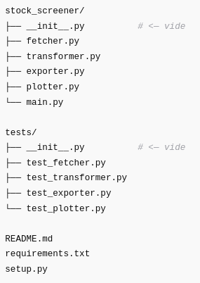

# Title: Investment_webscrapping

## Table of Contents

1. [Description](#description)
2. [Pre-requisite](#pre-requisite)
3. [Installation guide](#installation-guide)
4. [User Guide](#user-guide)
5. [Roadmap](#roadmap)
6. [LICENSE](#license)
7. [Contributors](#contributors)
9. [FAQS](#faqs)
10. [MISCELLANOUS](#miscellanous)

## Description:

**This project has 2 goals:**

[!CAUTION]
    1) *Helping me in my investing strategies by gathering the financials datas of interesting companies*

[!WARNING]
    2) _Improving my programming knowledge using in this case, web scrapping through python_

[!IMPORTANT]
    3) **_BONUS: Starting a data scientist portfolio_**

[!TIP]
    4) ~~Earning money...~~

[!NOTE]
<ins>The first commit will show a usable code and the following commits will improve the coding structure.</ins> :+1:

<!-- This content will not appear in the rendered Markdown -->

simple footnote[¹]

another one [²]

[¹]:footnote [url](https://github.com/S-S-Zheng/Investment_webscrapping)

[²]:footnote2 [url2](https://www.youtube.com/)

##### Final structure of the project:

README.md
requirements.txt
setup.py

## Pre-requisite:

Versions, dependencies...

## Installation guide:

Cmd to execute, potential issues...

## User guide:

Methods, options, I/O...

## Roadmap:

##### TODO - Make it works : DONE

##### TODO - Reshape its structure : DONE

##### TODO - Fix the tests forlder : DONE

##### TODO - Add the files/folders to ignore in the .gitingore: DONE

##### TODO - Correct values in millions and shares in thousand: DONE

##### TODO - Remove useless lines: Working progress

##### TODO - Ajouter des ratios?ROIC?

## LICENSE:

???

[MIT](https://choosealicense.com/licenses/mit/)

## Contributors:

Thanks to Me, Myself, I, Chatgpt.

Also pull requests are welcome. For major changes, please open an issue first to discuss what you would like to change.

Please make sure to update tests as appropriate.

## FAQS:

***
A list of frequently asked questions
1. **This is a question in bold**
Answer of the first question with _italic words_.
2. __Second question in bold__
To answer this question we use an unordered list:
* First point
* Second Point
* Third point
3. **Third question in bold**
Answer of the third question with *italic words*.
4. **Fourth question in bold**
| Headline 1 in the tablehead | Headline 2 in the tablehead | Headline 3 in the tablehead |
|:--------------|:-------------:|--------------:|
| text-align left | text-align center | text-align right |

## MISCELLANOUS:

Images : [Image text](/path/to/the/screenshot.png)
links : [links](https://github.com/S-S-Zheng/Investment_webscrapping)
feedbacks...